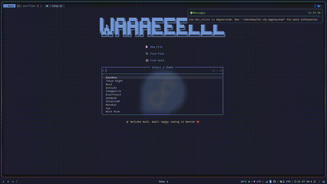

[](https://git.io/typing-svg)

<p align="center">
  
  
</p>
<p align="center">
  
  
</p>
<p align="center">
  
  
</p>
---


This repo contains my **Fedora** + **Hyprland** dotfiles:  
A clean, fast, and minimal Wayland rice with custom scripts, tweaked configs, and a sharp look.


### 🙏 Special Thanks

Big thanks to [JaKooLit](https://github.com/JaKooLit/Fedora-Hyprland) for his Fedora Hyprland setup — it helped me get started and inspired many parts of this rice.


---

### 🧰 Tools & Themes Used

| Category       | Tools / Apps                        |
|----------------|-------------------------------------|
| Shell          | Zsh, Starship                       |
| Terminal       | Kitty                               |
| Editor         | Neovim                              |
| Compositor     | Hyprland                            |
| Bar            | axe-shell + fabric                  |
| Launcher       | Rofi, Rofi-Games                    |
| Wallpaper      | Swww, Wallust, Matugen              |
| Notifications  | Swaync                              |
| Lock/Logout    | Wlogout, hyprlock                   |
| File Manager   | thunar + yazi                       |
| System Info    | fastfetch                           |
| Multiplexer    | Tmux                                |

---


## 🧠 Neovim Setup

<details>
<summary>⌨️ Neovim Custom Keybinds</summary>

```text
╔═══════════════════════════════════════════════════╗
║               🧠 Keybind Cheatsheet               ║
╠═════════════════╬═════════════════════════════════╣
║ Ctrl + o        ║ Save                            ║
║ x (after o)     ║ Save & Exit                     ║
║ Ctrl + q        ║ Quit                            ║
║ Ctrl + c        ║ Force Quit (no save)            ║
║ Ctrl + x        ║ Cut Line (to clipboard)         ║
║ Ctrl + k        ║ Close side Pane                 ║
║ Ctrl + y        ║ Redo                            ║
║ Ctrl + z/_      ║ Undo                            ║
║ Ctrl + a        ║ Select All                      ║
║ Ctrl + c (V)    ║ Copy to Clipboard (visual)      ║
║ Ctrl + v        ║ Paste from Clipboard            ║
║ <C-n>           ║ Toggle Nvim Tree                ║
║ <Tab>           ║ Cycle to Next Buffer            ║
║ <S-Tab>         ║ Cycle to Previous Buffer        ║
║ <C-p>           ║ Open Telescope Find Files       ║
║ <C-l>           ║ Vertical Split                  ║
║ <C-h>           ║ Horizontal Split                ║
║ <C-k>           ║ Close Current Split Pane        ║
║ <C-a>           ║ Select All                      ║
║ <C-Left>        ║ Move to Previous Pane           ║
║ <C-r>           ║ Open Recent Files (Telescope)   ║
╚═════════════════╝═════════════════════════════════╝
```

<details>
<summary>🎥 themes</summary>



</details>
</details>

---

## 🧿 Hyprland Keybinds

> 💡 Press **SUPER + h** to view all Hyprland keybindings in your system.

---

## ⭐ Support

If you find this setup helpful or inspiring, consider giving the repo a ⭐.
