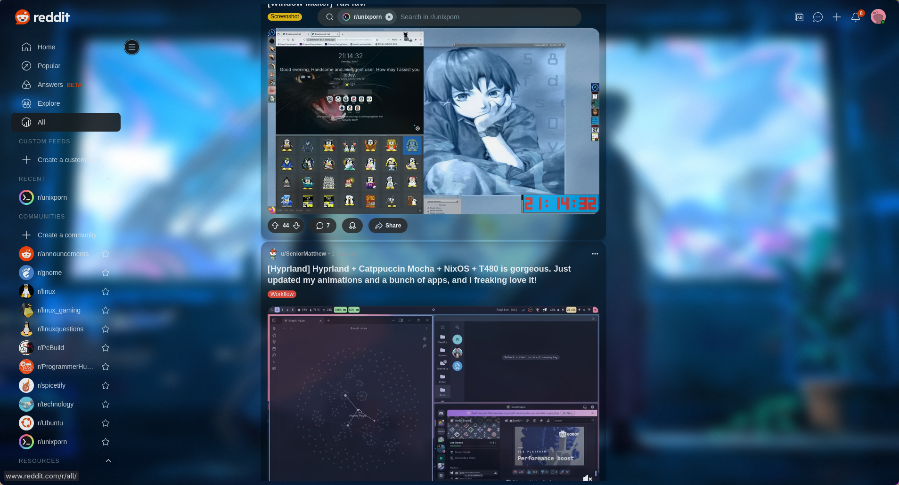

# Hyprland Dotfiles

A collection of configuration files and scripts for a customized Hyprland desktop environment on Linux.

## Features

- Modular configuration for Hyprland and related tools
- Theming for GTK, Qt, terminal, and more
- Scripts for automation and system integration
- Pre-configured widgets, status bars, and utilities

## Theme Gallery

A preview of available themes (numbered):

| Theme 16 | Theme 17 | Theme 22 | Theme 23 |
|----------|----------|----------|----------|
|  |  |  |  |

| Theme 24 | Theme 32 | Theme 33 | Theme 34 |
|----------|----------|----------|----------|
|  |  |  |  |

| Theme 12 | Theme 13 | Theme 15 | Theme 21 | Theme 31 |
|----------|----------|----------|----------|----------|
|  |  |  |  |  |

<!-- Add more rows as needed for other screenshots -->

## Folder Structure

- `Ax-Shell/` - Shell scripts and configs
- `btop/`, `eww/`, `fabric/`, `fastfetch/`, etc. - App and tool configs
- `hypr/` - Hyprland configuration
- `nvim/` - Neovim configuration
- ...and more

...existing content...