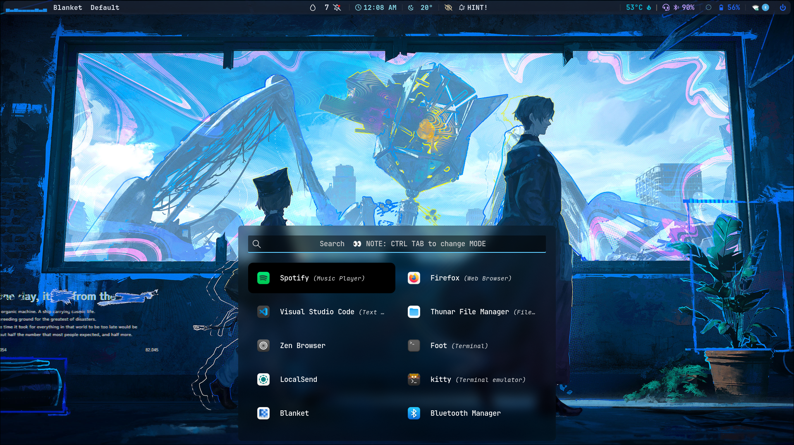
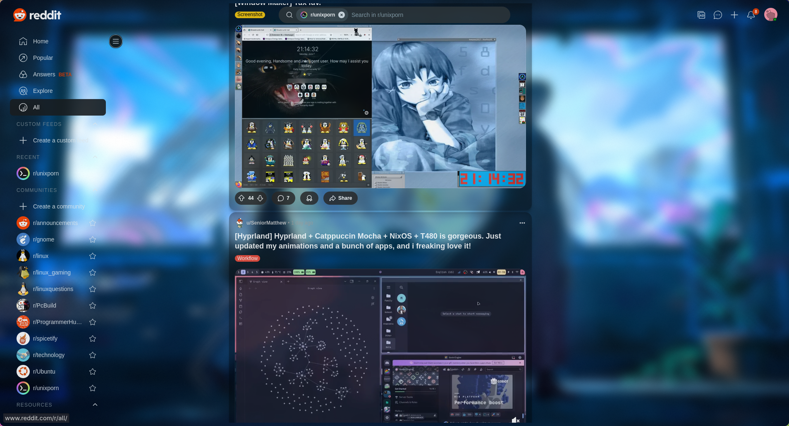
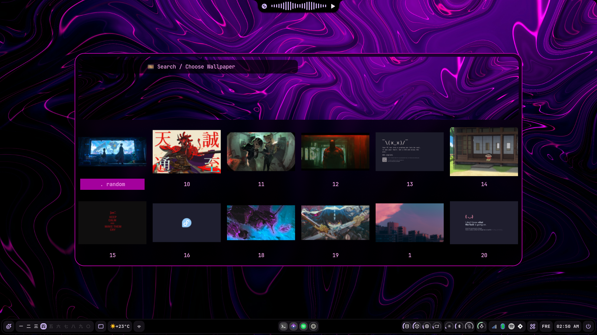
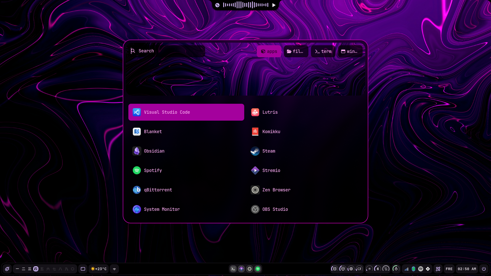
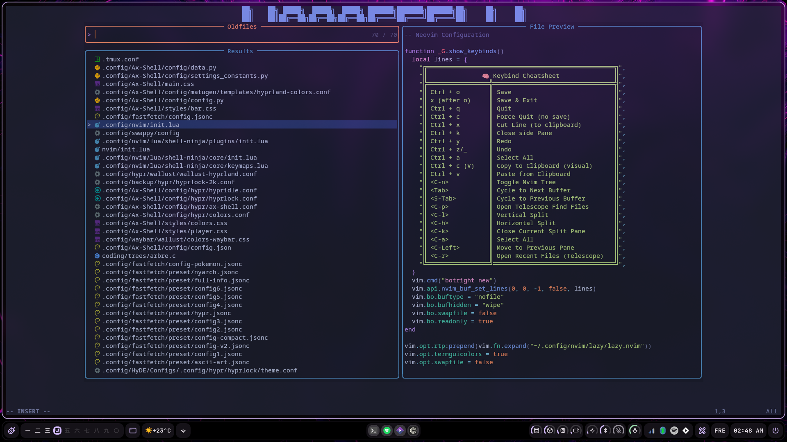
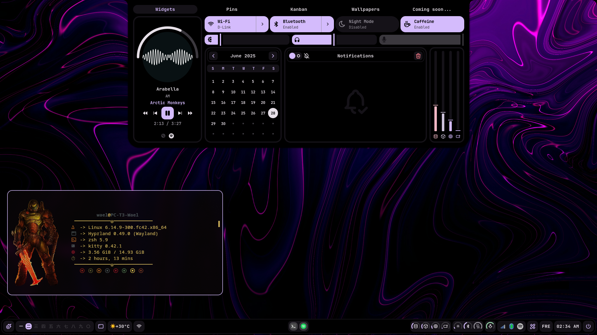
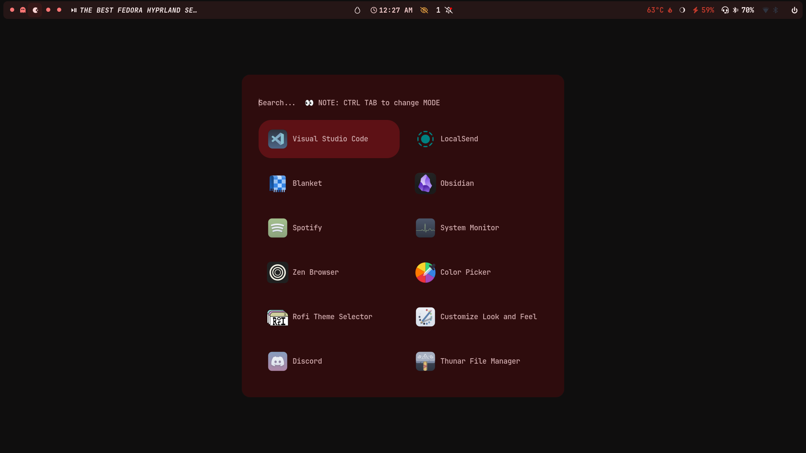
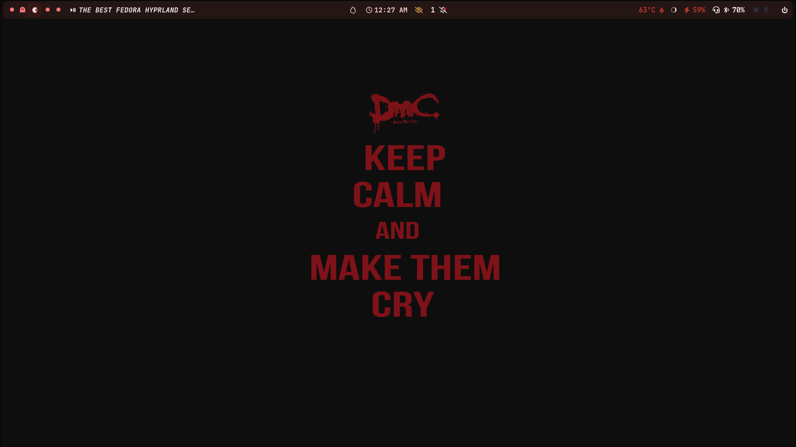
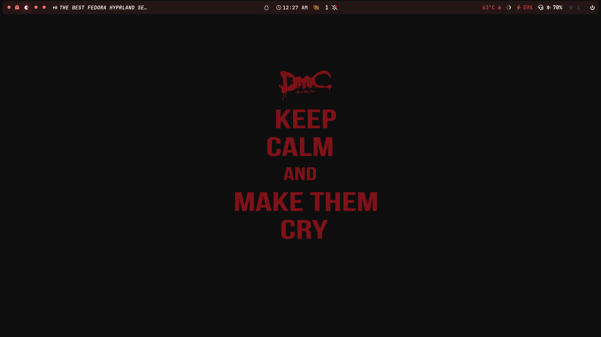

# ⚡ Hyprland Dotfiles — by sou1lah

A full custom Wayland desktop setup built around **Hyprland**, optimized for speed, minimalism, and eye-candy — with a touch of style and utility.

---

## 📦 Components

### 🪟 Window Manager
| Tool         | Description                       |
|--------------|-----------------------------------|
| **Hyprland** | Tiling WM with dynamic animations |
| **Waybar**   | Clean status bar with modules     |
| **Rofi**     | App launcher & powermenu (games UI too) |
| **Wlogout**  | Logout UI with style              |
| **Swaync**   | Notification daemon               |
| **Eww**      | Optional widgets & overlays       |
| **Ax-Shell** | Fabric-powered HUD and extras     |

---

### 🎨 Theming

| Tool         | Purpose                            |
|--------------|------------------------------------|
| **Wallust**  | Pywal alternative (GTK/Qt sync)    |
| **Matugen**  | Wallpaper-based color generation   |
| **GTK 2/3/4**| Consistent GTK theming             |
| **QT5ct/6ct**| Set QT themes                      |
| **Kvantum**  | QT theming engine                  |
| **Kitty**    | Themed GPU terminal emulator       |
| **Starship** | Beautiful shell prompt             |

---

### 🧰 Utilities

| Tool         | Purpose                         |
|--------------|---------------------------------|
| **Neovim**   | Full-featured text editor       |
| **Tmux**     | Terminal multiplexer            |
| **Ranger**   | Terminal file manager           |
| **Swappy**   | Wayland screenshot editor       |
| **Fastfetch**| System info fetcher             |
| **Neofetch** | Optional fetch tool             |
| **Btop**     | Graphical resource monitor      |
| **Nix**      | Declarative config (optional)   |
| **Fabric**   | Backend for Ax-Shell            |

---

Click to expand theme previews

### 🧊 Theme 1 – Blue

---

### 🟣 Theme 2 – Purple

---

### 🔴 Theme 3 – Red

